# 【2024年】香港手机卡完全攻略

::: danger 注意!!!
最近有无赖直接拿本文章打广告的（当前TG马甲为：尘归尘 土归土、特立独行侠等等）⚠​

大家千万不要与他交易，此人风评极差，各大论坛都有曝光他的骗子曝光贴，与很多人都有交易纠纷，大家谨防上当受骗！

如果需要买香港手机卡或香港代购任何其他物品，可联系
<br>
TG：[https://t.me/netdegree](https://t.me/netdegree)​<br>
QQ：88651795<br>
Email:anybenull@gmail.com
:::

::: danger 注意
收到卡后，将卡放在第一卡槽
并在网络设置中网络运营商，关闭`自动选择`，手动选择`中国联通`
:::


<b><font color=#FF0033>注意：用境外手机卡切记要在手机设置里要开启漫游，有境外打电话给你，不认识的号码一律挂断！！！不然8块钱一分钟（属于国际漫游，挂断不会扣费）</font></b>


## 一、香港手机卡买来能干嘛？

|  序号   | 可以做的事  |
|  ----  | ----  |
| 1  | <b><font color=#33CC33 size=4>注册各种不支持+86的手机号进行注册的境外平台，固定号码，比接码平台(例如sms-active)省事省心很多，也更加便宜和稳定​​</font></b><br>​说明：​可以注册港区Apple ID、WhatsApp、LINE、Google、Instagram、Telegram、Twitter(现已被Elon Musk更名为“X”)、SnapChat、Reddit等等境外平台的账号 |
| 2  | <b><font color=#33CC33 size=4>注册外服游戏​</font></b><br>​例如暴雪亚服等 |
|3|<b><font color=#33CC33 size=4>注册Alipay HK​</font></b><br>​说明：Alipay HK有很多新用户优惠可以薅，如果你去香港旅游可以整一下|
|4|<b><font color=#33CC33 size=4>注册WeChat账号，使用香港号码注册的微信，可以开通 IOS 微信的 Callkit功能，并且一开始附赠 8 HKD的 Callkit 余额​</font></b><br>说明：<br>​使用香港号码注册的WeChat账号进入群聊不需要绑银行卡，大陆手机号注册的微信号则需要​<br>CallKit 是苹果在 iOS 10 上线的一项功能，它能够让用户在使用第三方应用的语音聊天功能时，直接看到来电画面，并且语音聊天记录会记录到通话记录中<br><b><font color=#CC0033 size=4>新注册微信号，笔者也可以提供微信解封、辅助注册套餐​</font></b>|
|5|<b><font color=#33CC33 size=4>去香港玩时，作为性价比超高的4G高速网络的流量卡使用​</font></b>​<br>说明：​<br>以我使用的中国电信来说，香港流量漫游套餐，23.8元，2G流量，上网还不能科学要自备梯子，有效期1天​<br>而hahasim则是33港币，60GB高速流量，5000分钟本地通话，流量可科学，有效期30天，有了这张卡，在香港完全没有流量焦虑！！！|
|6|<b><font color=#33CC33 size=4>出国游玩时，可开通各国漫游套餐使用流量，套餐价格还是比较划算的​</font></b>​<br>说明：地区流量包包括但不限于：香港、亚洲、北美、澳纽、欧洲、中东、非洲等等全球100+国家上网|
|7|<b><font color=#33CC33 size=4>注册阿里云国际站​</font></b>|

## 二、需求场景
1、在内地注册境外平台等接码用，完全不会用到流量​

2、用于境外远程工作等，主要在内地使用漫游流量​

3、经常来往香港的人士，希望能作为自己的香港主号使用，香港本地流量、通话、短信都兼顾


## 三、全网最全问答：

### 1、哪里买

香港街头有很多电信运营商店，都可以购买手机卡，常见的有SmartTone、CSL、中国移动、丰泽、屈臣氏等​

如果不方便去香港，不想眼花缭乱挑手机卡，推荐hahasim，笔者自己也在用，有现货可以购买

<b><font color=#CC0033 size=4>现货当天下单直发，广东省内隔日达​​</font></b>|

其他联系方式：​

TG：[https://t.me/netdegree](https://t.me/netdegree)​<br>QQ:88651795<br>Email:anybenull@gmail.com

### 2、到手怎么玩？
<b><font color=#00CC00>注意点一</font></b>：如果您是小米手机，插卡是会默认发送激活短信的，这样会扣除3.5 HKD的短信漫游费用，下面是解决方法：（注意：未发现其他品牌手机有此奇葩机制）

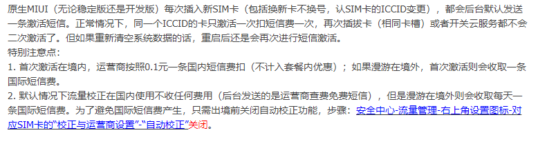

<b><font color=#00CC00>注意点二</font></b>：安卓版的，官网App有问题，激活一直提示系统繁忙​<br>
丰泽官网的安卓app有问题无法激活，推荐在谷歌应用市场、apkpure下载应用进行激活~不要使用激活短信里的app下载链接，那个是旧版的~ 点此进入下载：[hahasim 安卓App APK Pure下载地址](https://apkpure.com/cn/haha-travel-by-fortress/com.fortress.sim)（亲测华为鸿蒙2可正常安装运行）​

<b><font color=#00CC00>注意点三</font></b>：APN（一般都是自动设置好的）如果系统强烈提示到你说需要你去手动设置，那你就设置为：[mobile.lte.three.com.hk](http://mobile.lte.three.com.hk/)

* * *

本教程主要以hahasim的介绍为主，本人也是一直在使用hahasim的~~​

hahasim卡片可以在大陆激活，也可以在香港激活​

激活的方式：到Google 应用市场或者Apple 的AppStore 下载名叫“haha TRAVEL” 的App，插上手机卡，等待数分钟，会收到hahasim的激活短信，短信中包含你的手机号码，这是最重要的内容！接到短信就可以按短信中的内容提示来激活了，短信内容模板大概如下：

```shell

[Fortress haha SIM] 儲值卡啟用通知。​

重要提示：根據法例，於2022年3月1日或之後購買的儲值卡，使用香港服務前須實名登記，在成功登記前你的本地服務會被暫停。​
儲值卡號碼: *********​
儲值額: $50.0​
儲值卡有效期至 15/09/2024 09:00 (香港時間)。​
辦理實名登記:​
https://bit.ly/HahaRNR​
​請即下載 haha TRAVEL 手機應用程式，於App內輸入電話號碼及掃描此卡QR code​
iOS/Android:​
https://mmedia.fortress.com.hk/fortress-sim/qrcode.html​
Android APK:​
https://mmedia.fortress.com.hk/fortress-sim/hahaTravel.apk​
[Fortress haha SIM] SIM Activation completed​
​Important notice: Under the law of Hong Kong, registration before use is required for prepaid SIM cards purchased on or after 1-Mar 2022. Your Hong Kong services (if any) are suspended before successful real-name registration.​
Your mobile no. is: *******​
Stored value: HK$50.0​
SIM Expiry date: 31/12/2024 09:00 (HK Time).​
​Complete real-name registration:​
https://bit.ly/HahaRNR-en​
Please download the haha TRAVEL app, enter the mobile number in the app and scan the card QR code​
iOS/Android:​
https://mmedia.fortress.com.hk/fortress-sim/qrcode.html​
Android APK:​
https://mmedia.fortress.com.hk/fortress-sim/hahaTravel.apk​
```

hahasim官方激活教程（Youtube）：[https://www.youtube.com/watch?v=1mEwogNjYuw](https://www.youtube.com/watch?v=1mEwogNjYuw)​


附件不支持打印

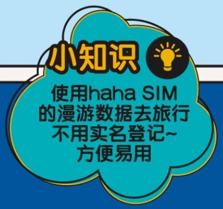

​在大陆使用，该卡可以不实名​
若实名，实名认证支持的证件选项如下：（只需要上传身份证照片，不需要人脸识别、人脸扫描等等其他生物识别类操作）​

A. 港澳通行证​

B. 护照​

C. 大陆身份证​

D. 香港身份证（HKID）​

E. 其他（可证明你身份的资料，相比其他证件需要审核更久）
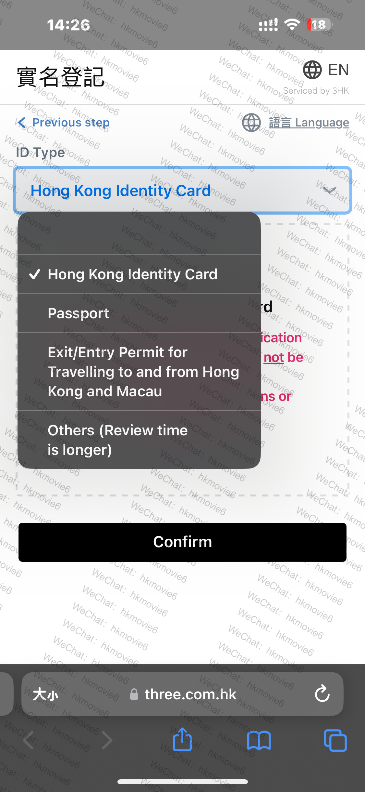

### 3、保号资费怎么算？

<b><font color=#9933CC>常见误区1</font></b>：这个卡只要有余额，或者余额大于20，就是永久有效就可以一直使用下去的吧？

答：❌并不是！<font style="background:#FFFF66;color:#CC3333">一年内有充值才不会过期，充值最低是20港币起充，如果只消费套餐（比如开个10港币的套餐）是无法刷新有效期的，亲测，现在网上很多所谓的教程都在误导人！让别人以为hahasim 10港币就能保号，其实这是错误的！</font>

<b><font color=#9933CC>常见误区2</font></b>：接短信多少钱？​

答：日常开机挂着、接短信，都是不要钱的哈~​

<b><font color=#9933CC>常见误区3</font></b>：我是不是拿到卡就要激活？​

答：最迟2024年12月31日前激活即可~​

<b><font color=#9933CC>常见误区4</font></b>：我保号去haha Travel app购买套餐就可以是吗？购买套餐要实名吗？

答：购买套餐不能保号，仅凭充值就能保号，充值是不需要实名的​


<br>

收到卡，有50HKD余额，此时，你的手机号没有开通任何套餐，因此，没有通话分钟、流量~​

但！<font style="background:#FFFF66;color:#CC3333">使用卡内初始的50 HKD 余额，激活后有效期就有一年无需开通套餐等，一年后，充值 20HKD即可保号，续一年</font>


### 4、保号怎么搞？
保号需要充值一次，充值一次刷新储值卡有效期为一年（从充值日期当天开始算），不需要你像Google Voice那样要发短信、打电话、走流量才能保号~~~​

收到手机卡后，先按短信提示激活卡，卡内目前有50HKD余额可以直接用，也可以不使用​

激活后，如果想要开套餐，打开haha TRAVEL应用程序，进入【数据计划】，可以选择想要的数据计划

### 5、怎么充值？
方式一：App内含的4种充值方式​

无论你身处何地，只要打开haha TRAVEL应用程序，即可充值，一次充值的金额从 20 HKD 到 1900 HKD不等，按自己需要的金额充值​

支持的付款方式：VISA 、Mastercard 、AlipayHK（这是香港支付宝，大陆支付宝不支持） 、ApplePay​

此处的充值选项中的VISA、MasterCard等，是支持大陆发行的外币信用卡的，笔者亲测充值成功！
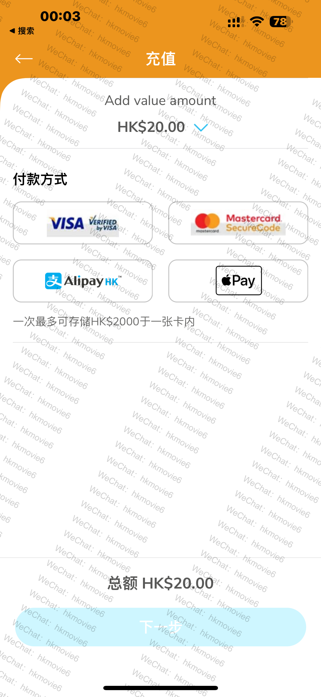

方式二：Alipay HK 储值充值​

其实还有一种充值方式，不需要信用卡甚至不需要银行卡，也不需要任何其他卡，并且一次操作可以顶5年的充值，方法如下：​

第一步，用你的手机号注册个香港支付宝（Alipay HK），联系我，我在香港找一家便利店，在便利店里用现金为你的Alipay HK的储值余额进行增值，然后后面你就用香港支付宝给手机卡充钱就行了（消费储值余额是不需要对Alipay HK进行HKID的实名认证的），比如一次给你储值100，那么你就可以用Alipay HK应付手机卡后续5年的充值（一次最低充值20港币）
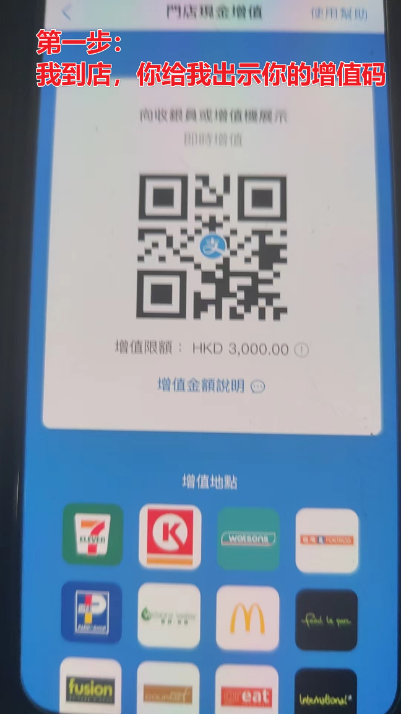
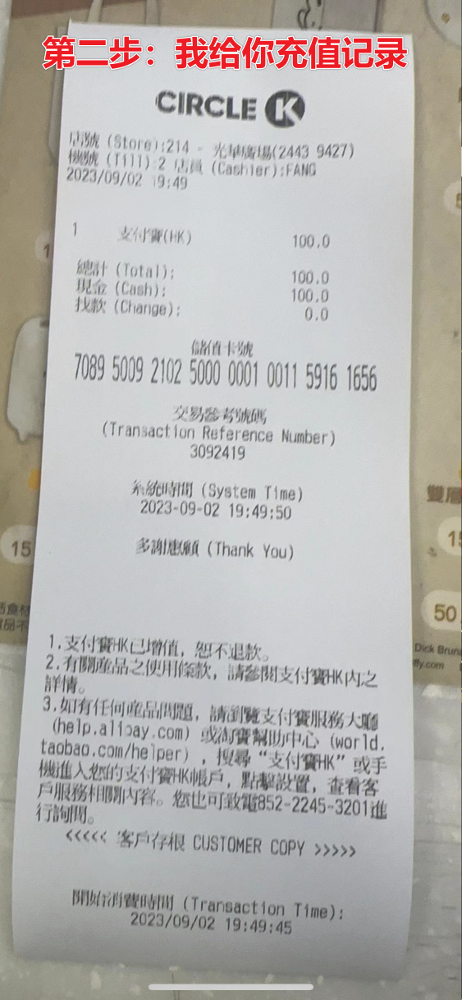


### 6、大陆用怎么收费？
如果只用于接短信，只需要每年过期前一两天充值20港币即可​

如果要使用漫游流量，最低的流量漫游套餐叫做：“亚洲5地”，这是一款日租上网套餐, 1天10港币，合法在大陆上外网，流量为500MB的4G流量，500MB用完后，无限流量，但速率只有 128kbps​

除了上面的，下图中打勾的都可以，如果是在大陆用流量，138港币的大湾区一个月15GB套餐是最便宜的了，大湾区只是套餐名字这么叫，实际上大陆内地各地都是可以通用的

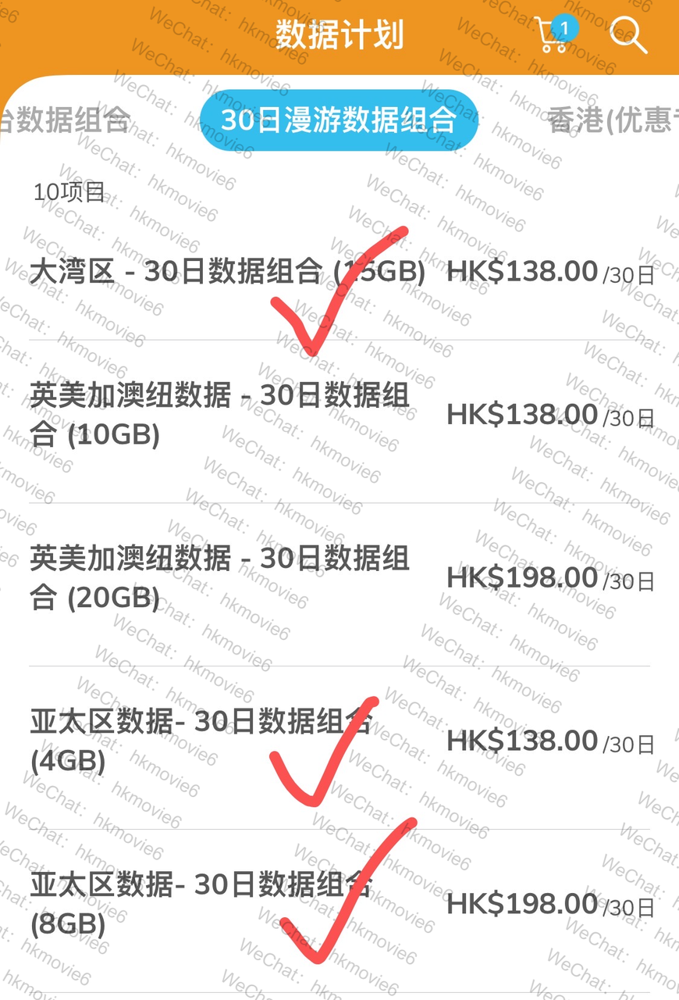

### 7、接电话收费吗？
在香港本地接电话是不收费的，在其他地区，接打电话的资费如下：
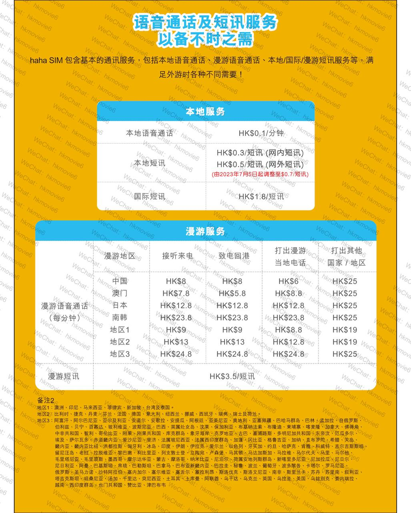

### 8、是否科学？
<b><font style="background:#FFFF66;color:#CC3333">开套餐，用该卡的流量就可以在大陆科学，并且IP归属地为中国香港</font>​</b>

<b><font color=#9933CC>常见误区1</font></b>：用这个卡不开数据连接wifi可以科学？：NO❌，不行！​

<b><font color=#9933CC>常见误区2</font></b>：这个卡在福建是不是不能用？：经过群友亲测在福建使用并没有什么限制，是可以正常使用的


### 9、是否可以选号码？
选不了号码，号码是开盲盒一样分配给你的，号卡激活后，按照正常保号步骤即可长期持有该香港号码（+852，大陆是+86）
### 10、我该选什么卡？
大部分内地朋友长期持有一张港卡的需求都是用于注册境外平台，可以稳定接短信验证码即可，因此低资费保号型是适合大部分人的，为什么不推荐流量型的卡？因为国际漫游流量就没有便宜的，不管是任何运营商任何卡种，流量套餐动不动就要上百块钱，这百来块钱你能得到的，要么就是有效期就只有30天，百来块只能用30天你真的玩得起吗？重度使用的话一年要上千块，流量还不一定够用，要么就是有效期是有一年，但只有十几GB流量，百来块钱只有十几GB流量哦~没几下就造完了的​

因此，如果是科学上网的需求，还是买机场服务性价比更高，上百块钱基本可以订阅比较好的机场服务了，并且流量的性价比还吊打所有境外卡的国际漫游流量~​

如果您看下来，对如何选择还是非常纠结，<b><font style="background:#FFFF66;color:#CC3333">无脑选Hahasim即可</font></b>，hahasim就是少了个esim功能，国内对esim的支持很差，只有美版等水货iPhone才支持esim功能，而clubsim的流量套餐相较于hahasim太贵了，不划算，clubsim在大陆没法打电话， 功能更加受限制，且clubsim在大陆使用也需要实名，而hahasim和clubsim的保号成本是基本持平的，因此更推荐hahasim~

小结：​

1、clubsim无法接打电话，hahasim可以，可以应付语音验证的场景​

2、clubsim后续的流量资费较贵，hahasim性价比更高​

3、clubsim在大陆必须实名使用，hahasim在除香港地区以外使用不需要实名​

​

Hahasim从综合上来说比Clubsim好很多，只是这卡刚出一年多，知名度还没Clubsim那么高，Clubsim已经运营了数十年了~​

​

更别说Mysim和Sosim了，套餐相比于hahasim没任何优势，而保号费用高达200港币，直接忽略即可~​

这两张卡都是不懂卡的小红书上的小仙女们炒起来的，因为比较方便买，因此方便她们给别人代购，而没有对卡的资费等等信息进行货比三家~
### 11、其他Q&A
<font color=#CC3333>Q1：卡片损坏或者遗失如何补卡？​</font>
<br>
<br>
<font color=#33CC33>A1：卡片在实名认证后，可找客服补卡​​</font>

<br>
<br>

​<font color=#CC3333>Q2：什么号码呢？​​</font>
<br>
<font color=#33CC33>A2：这个是+852的香港本地号码，是全新未拆封的，具体的号码是要插卡激活才能知道的哈，号码是开盲盒选不了号码的​​​</font>


<br>
<br>

​<font color=#CC3333>Q3：注册TG收不到验证码怎么办？​​</font>
<br>
<font color=#33CC33>A3：接短信是需要开漫游的，接短信是需要开漫游的，接短信是需要开漫游的，重要的事情说三遍，手机设置里有漫游开关，摸索一下，但也可能是TG的短信服务通道抽风了，可以下载一个Telegram X重新接码注册，点击链接下载：​​​​</font>

[<font color=#0066CC>Telegram X（谷歌商店）​​​​</font>](https://play.google.com/store/apps/details?id=org.thunderdog.challegram&hl=en_US&gl=US)

<font color=#FFCC33>​更多注册失败的解决方案请移步）​​​​</font> [附录五](/card/#五、附录二-注册失败处理大全)
​
<br>

​<font color=#CC3333>Q4：双卡双待手机上可以一张电信卡，一张hahasim卡吗？​​</font>
<br>
<font color=#33CC33>A4：可以的，这就是正常的手机卡，在大陆是中国联通卡，你将它就视为一张普通的中国联通卡使用即可​​​​</font>

<br>

​<font color=#CC3333>Q5：登录App提示我绑定易赏钱（MoneyBack）、课金易什么的，怎么办？​​</font>
<br>
<font color=#33CC33>A5：忽略即可​​​​​</font>

<br>

​<font color=#CC3333>Q6：如何拦截香港的骚扰电话？​​​</font>
<br>
<font color=#33CC33>A6：可以试试App：小熊来电、芝麻开门，还可以[点此查询](https://hkjunkcall.com/?ft=36630664)打给你的电话是否是垃圾电话​​​​​</font>
​


## 四、附录一：卡片实拍照
### 1、hahasim
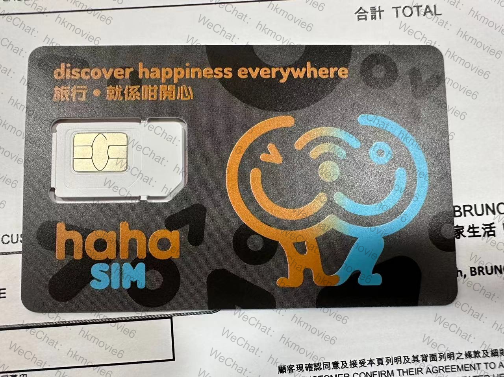
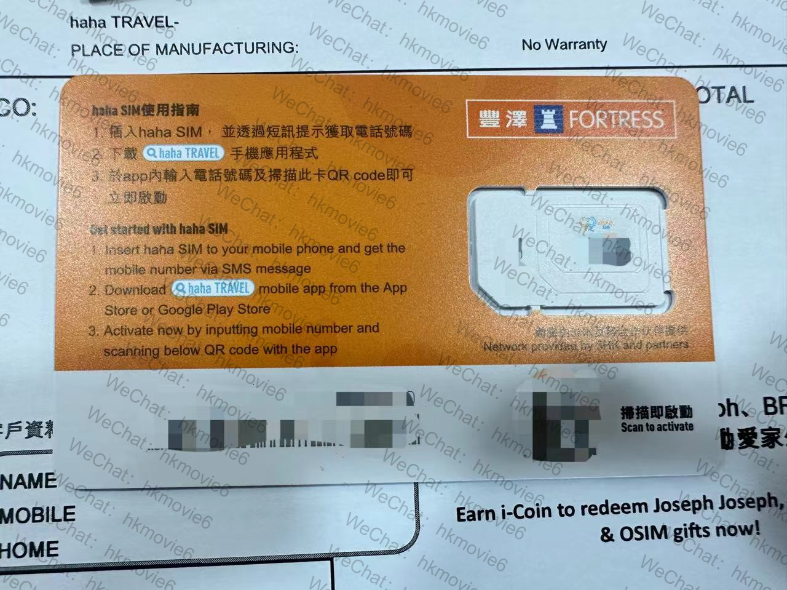
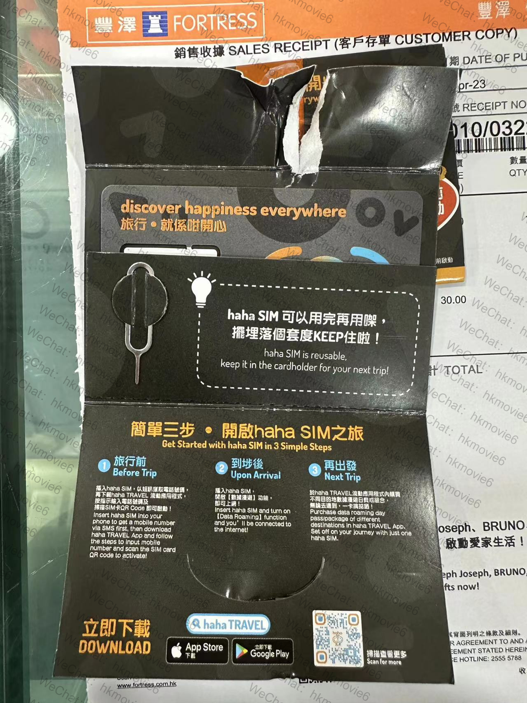
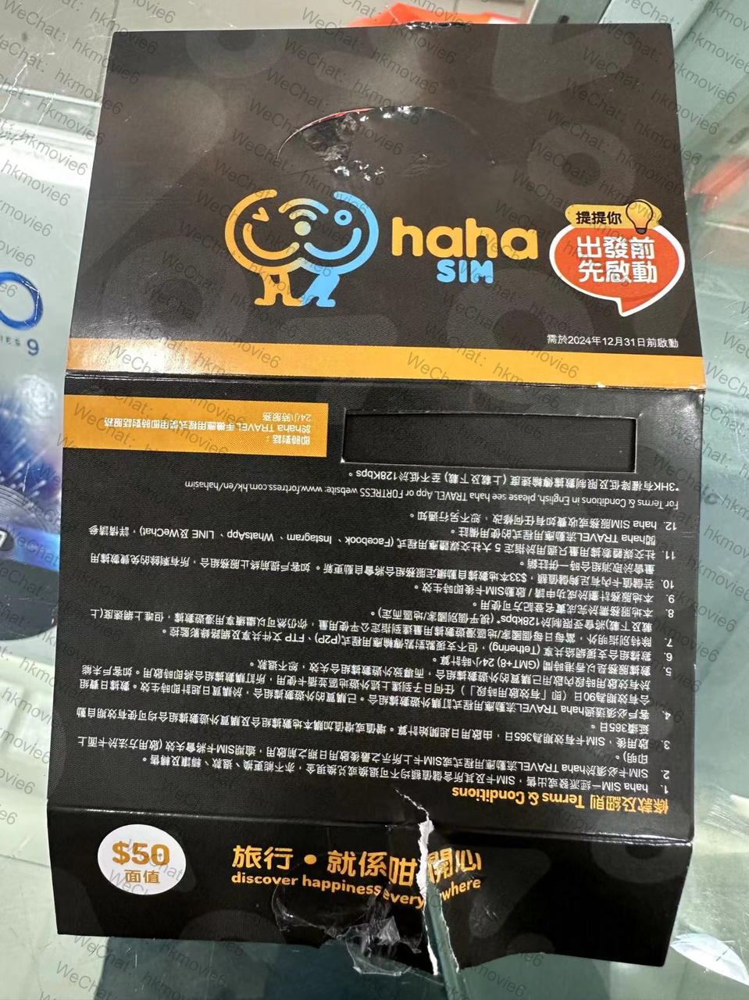

### 2、clubsim
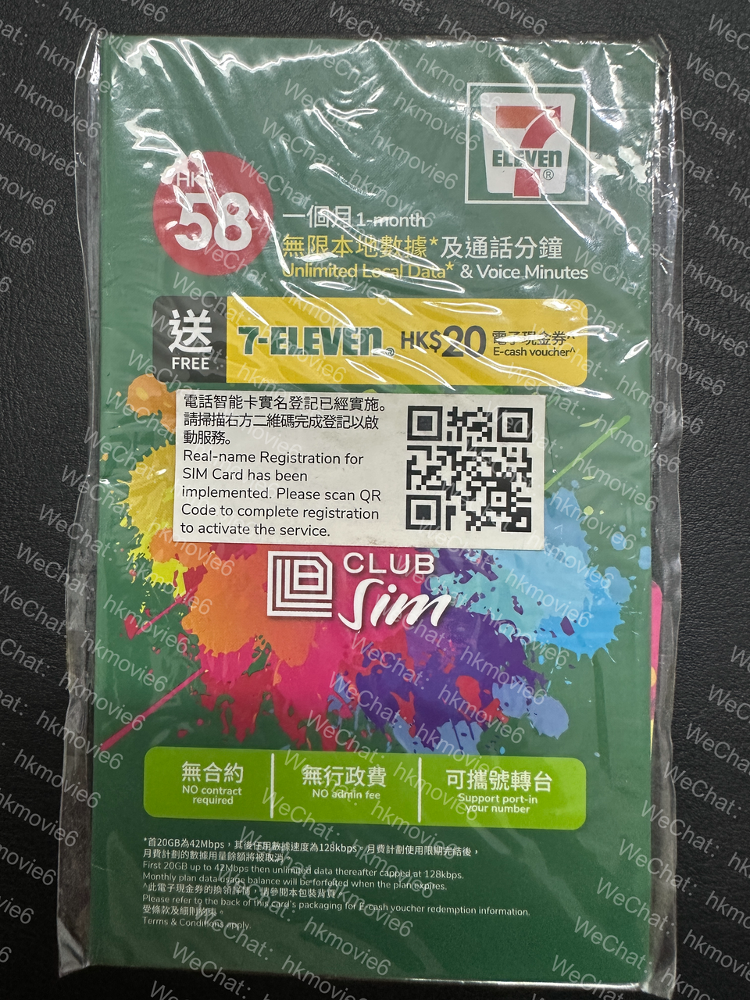
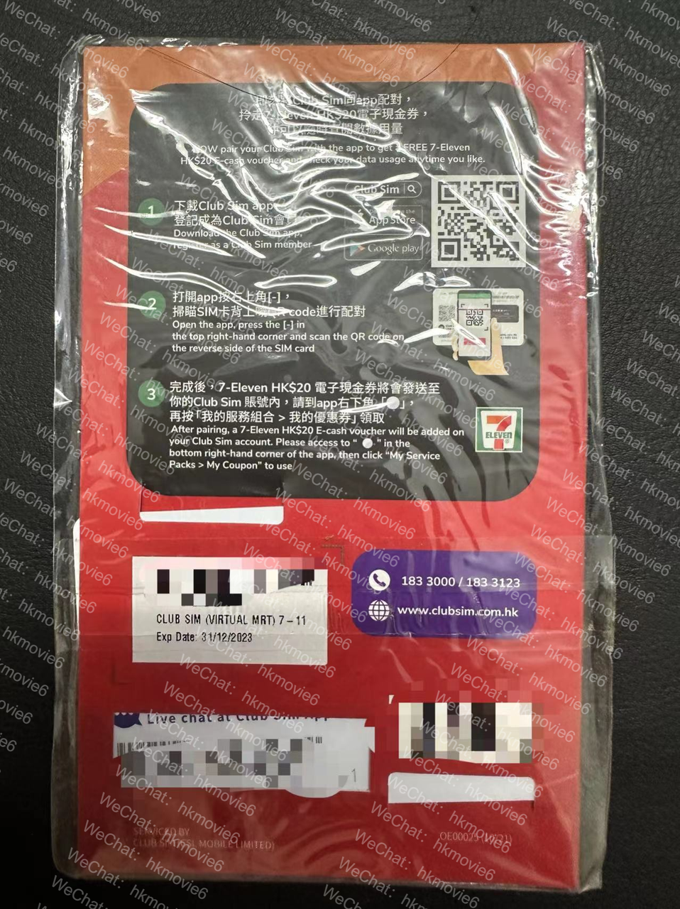


## 五、附录二：注册失败处理大全
​<font color=#CC3333>为什么我注册XX平台，提示号码已经被注册？​​​​</font>
<br>
<font color=#33CC33>你可能遇到了一个被别人使用过的号码，遇到这种情况的概率大概是1%，上一个此号码持有者很久不用之后，运营商将会回收此号码，然后重新放回号码池中，然后被你选中了，这是一种正常会出现的情况，与卡的卖家没有太大关系，遇到这种情况，请第一时间先和你要注册的平台的客服支持取得联系，进行申诉等各种操作，可以在百度、谷歌搜索遇到相同情况的用户他们是怎么解决这个问题的~​​</font>


### <b><font style="color:#CC9900">情况一：Telegram，如果是注册TG提示”This phone number is banned.“​</font></b>
<font color=#33CC33>解决办法：就点那个"Help"按钮，系统会自动申请一封申诉邮件，然后发送就可以了，过了一会会，再试就可以收到验证码了​​</font>


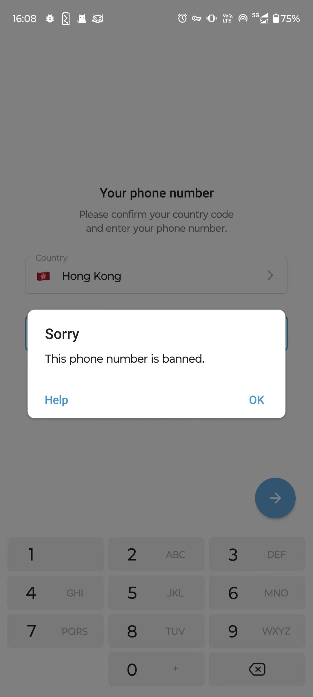

### <b><font style="color:#CC9900">情况二：暴雪战网游戏平台，提示手机号已经被注册​</font></b>

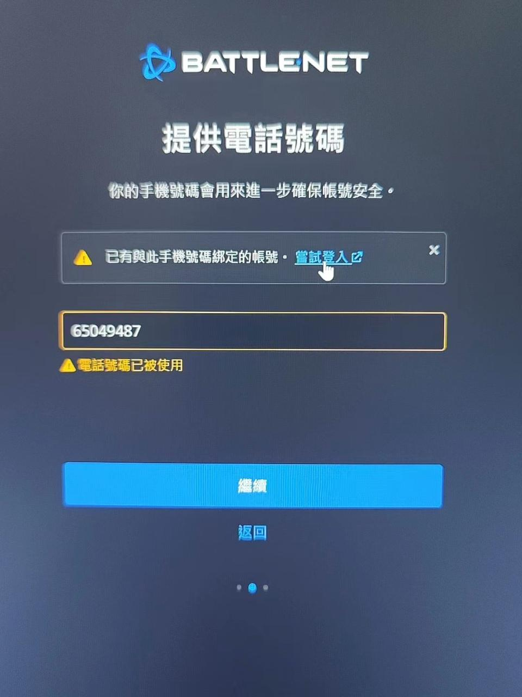

<font color=#33CC33>提交工单，联系客服，客服回复如下：​​</font>
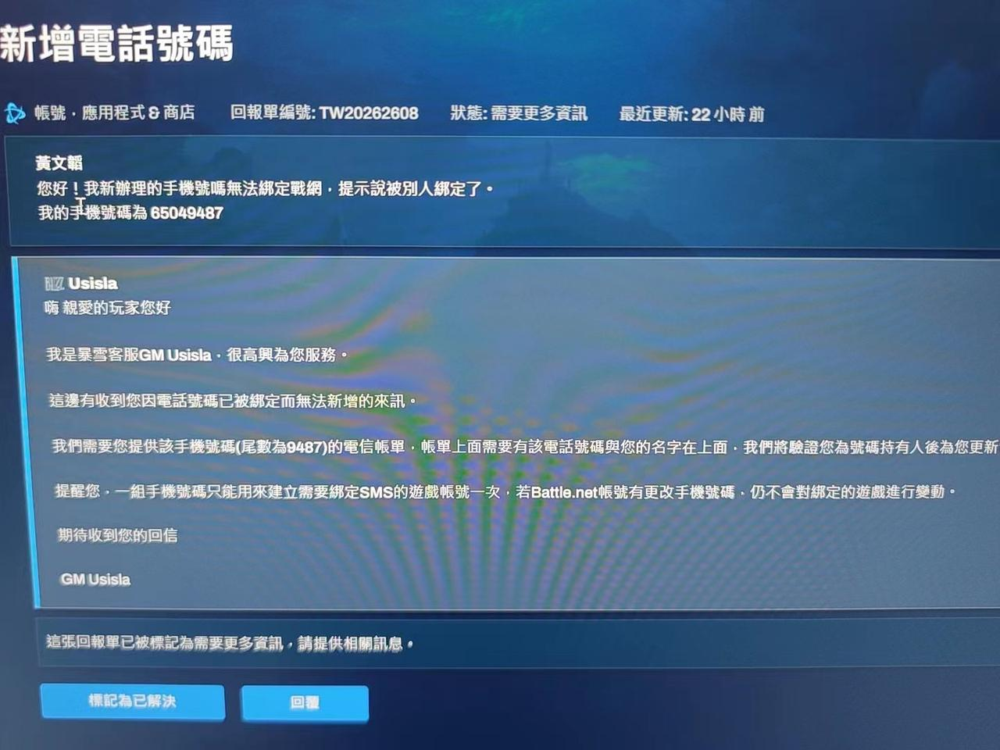

<font color=#33CC33>此时，你继续回复工单，提供交易记录（没有的话就临时消费10港币或者充值20港币）、帐户页面的截图如下，发给客服时不要打码​​</font>

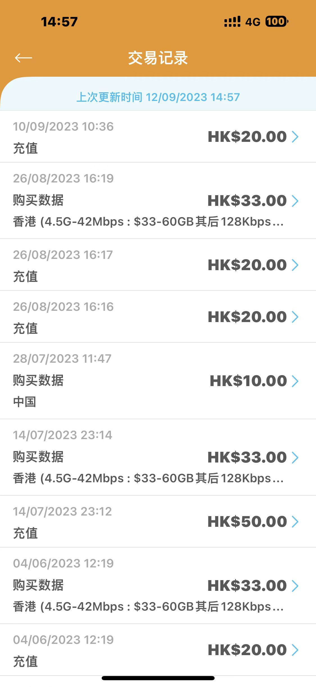
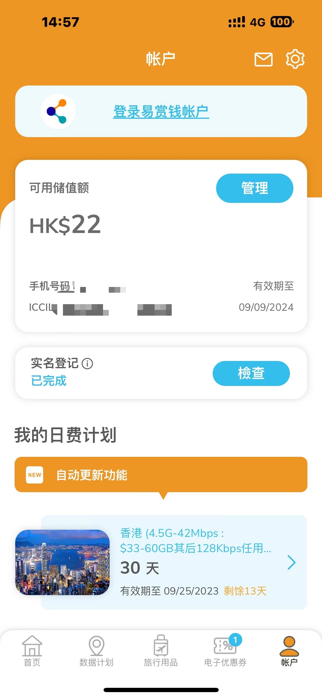

<font color=#33CC33>客服就会为你解绑之前的账户，就可以正常注册了​</font>


### <b><font style="color:#CC9900">情况三：注册Google，提示“此号码无法用于进行验证”或“这组电话号码无法用于验证身份”​</font></b>


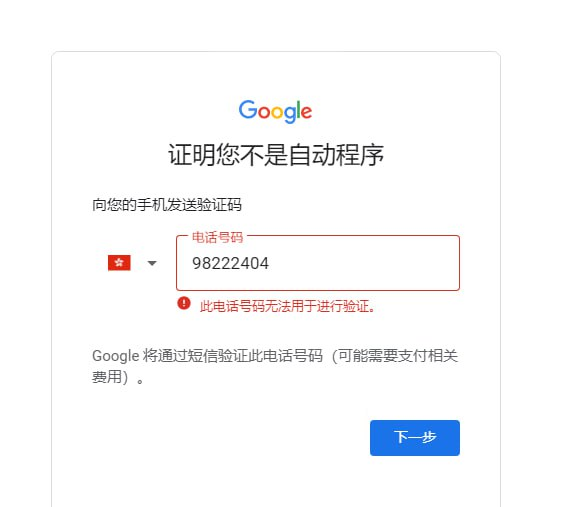


<font color=#33CC33>出现此提示请放心，并不是你的号码有问题，而是因为你目前所使用的网络代理曾被人用来恶意使用（例如用来DDOS攻击、爬虫等），导致被谷歌封禁了，换个节点、换个代理IP就能解决此提示​</font>


## 六、附录三：香港实体银行开户指南
直接找到分行地址，在营业时间前半小时到店排队，填单（填单会需要你填国内有效地址，直接填你身份证地址就行），然后办理，要你出示地址证明就给身份证，如果不认，直接放言：“我将投诉你的故意刁难行为到香港金管局，并且要求给出具体理由”，如果口头警告没用，直接投诉香港金融管理局，[点此直达投诉](https://www.hkma.gov.hk/gb_chi/smart-consumers/complaints/)​

以下是亲测的投诉回复邮件：
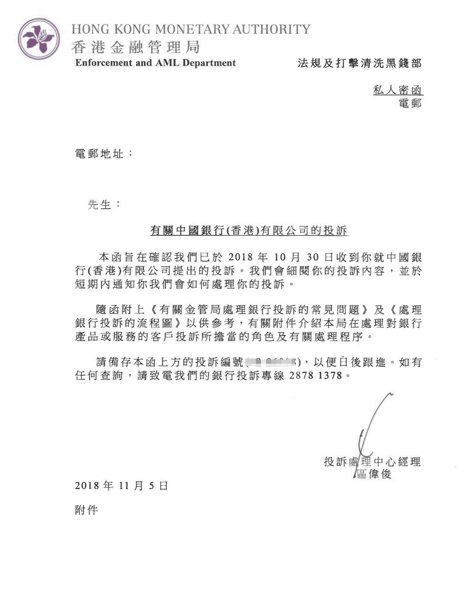


## 七、附录四：接收不到短信?网路运营商选择
收到卡后，将卡放在第一卡槽
并在网络设置中网络运营商，关闭<b><font color=#CC0033 size=4>自动选择​</font></b>，手动选择<b><font color=#CC0033 size=4>中国联通​</font></b>

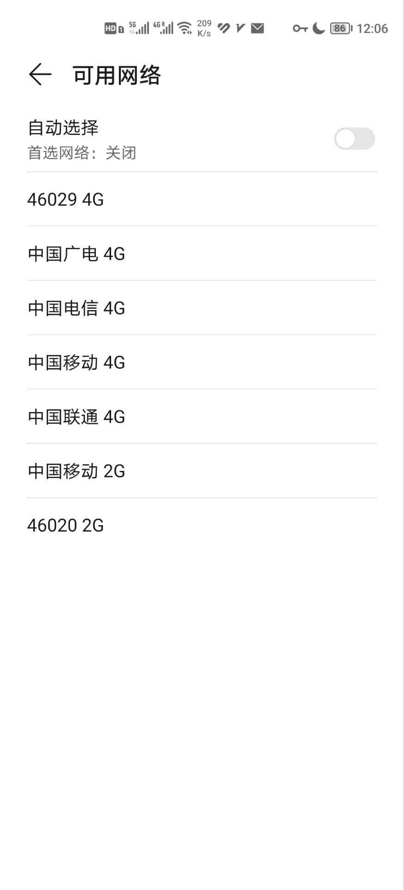


